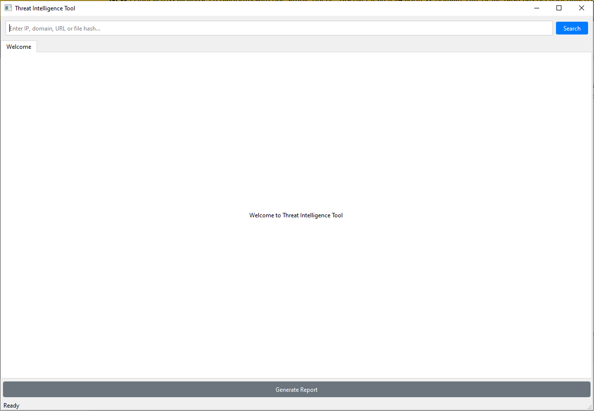
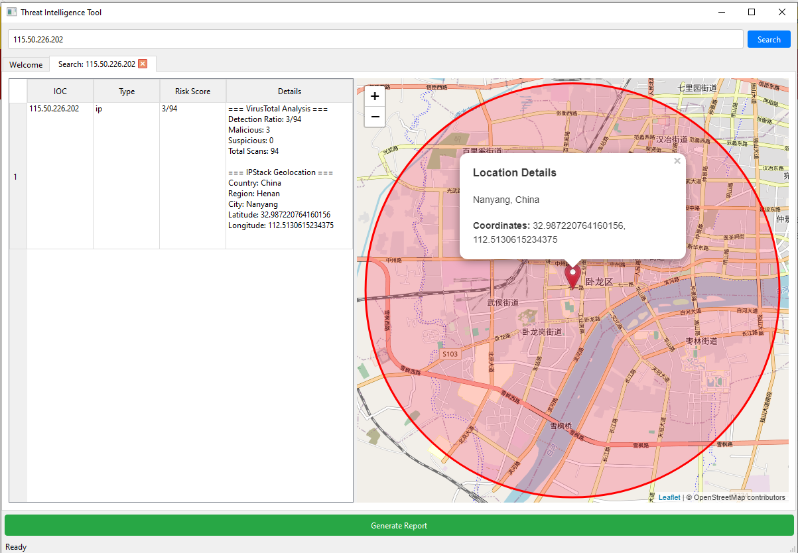
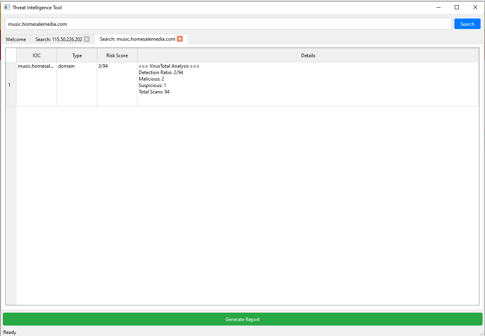
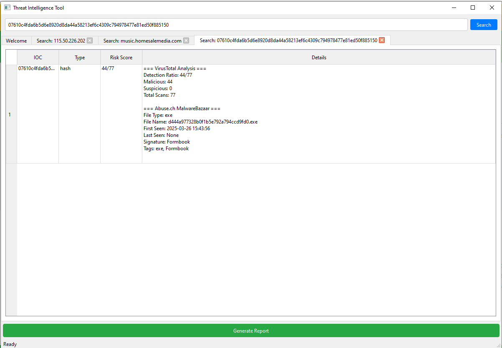
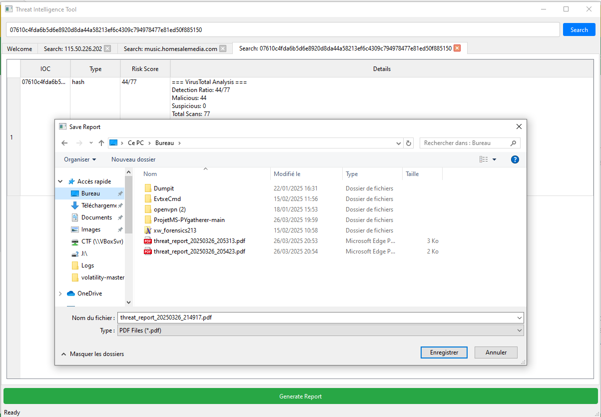
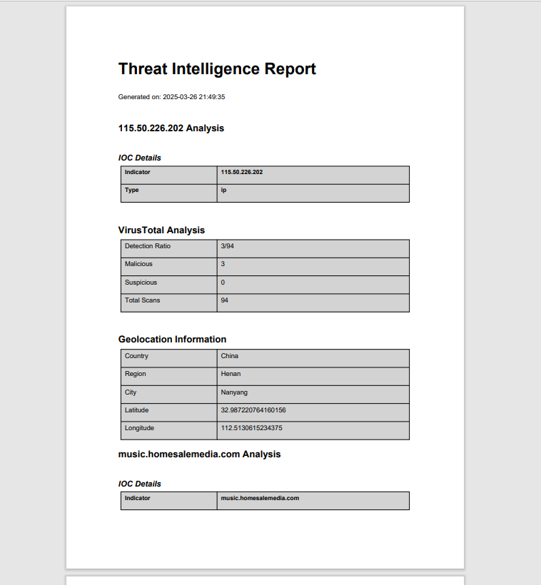

# ProjetMS-PYgatherer

## Description

L'outil qui a été dévélopper a pour objectif de fournir de plus ample informations concernant des potentiels IOC malveillants.

Pour cela, il va requêter différentes bases de donées :

- VirusTotal
- MalwareBazar
- Ipstack

Il permets de prendre en entrée :

- ip
- domaine
- hash

## Installation 

### Windows

#### Ajout les clés API

Pour utiliser VirusTotal et Ipstack, il faudra créer un compte sur chaque site, et récupérer la clé API de chauqe outil.

Ajouter les clés dans des variables d'environements avec cmd:

        setx VT_API_KEY "$Api_Key"
        setx IPSTACK_KEY "$Api_key"

Note: Des informations fictives ont été enregistrées dans l'application, donc sans clés API, elles seront prises par défaut. 

#### Exécution

L'application a déjà été compilée pour Windows, pas besoin d'installer python sur la machine. 

Chemin de l'exécutable: compile/ioc_analysis.exe

### Linux

#### Git clone

Cloner le repository et se déplacer dans le répertoire:

        git clone https://github.com/WeWonderMax/ProjetMS-PYgatherer.git
        cd ProjetMS-PYgatherer

#### Environnement python

Créer un environnement python:

        python3 -m venv venv

Activer l'environnement :

        source venv/bin/activate

#### Dépendances
Installer les dépendances 

        pip install --requirement requirements.txt

#### Ajout les clés API

Pour utiliser VirusTotal et Ipstack, il faudra créer un compte sur chaque site, et récupérer la clé API de chauqe outil.

Ajouter les clés dans des variables d'environements:

        export VT_API_KEY='$Api_Key'
        export IPSTACK_KEY='$Api_key'

Note: Des informations fictives ont été enregistrées dans l'application, donc sans clés API, elles seront prises par défaut. 

#### Exécution
Exécuter l'application avec le fichier main.py:

        python3 main.py

## Démo

### Page d'accueil 

Une fois l'application lancée, la page d'ccueil est la suivante :

### Recherche sur une IP

La recherche sur une ip va donner plusieurs informations:

- Type d'ioc
- Risk Score de VirusTotal
- Le détail des bases de données (VirusTotal et Ipstack)
- La map avec la géolocalisation de l'ip 

### Recherche sur un domaine 

La recherche sur un domaine va donner plusieurs informations:

- Type d'ioc
- Risk Score de VirusTotal
- Le détail des bases de données (VirusTotal)

### Recherche sur un hash

La recherche sur un hash va donner plusieurs informations:

- Type d'ioc
- Risk Score de VirusTotal
- Le détail des bases de données (VirusTotal et MalwarBazar)

### Export des résultats en pdf

Une fois avoir réalisé les différentes recherches sur nos indicateurs, il est possible de les exporter avec le bouton "Generate Report" :

Voici un exemple de résultat de rapport :
